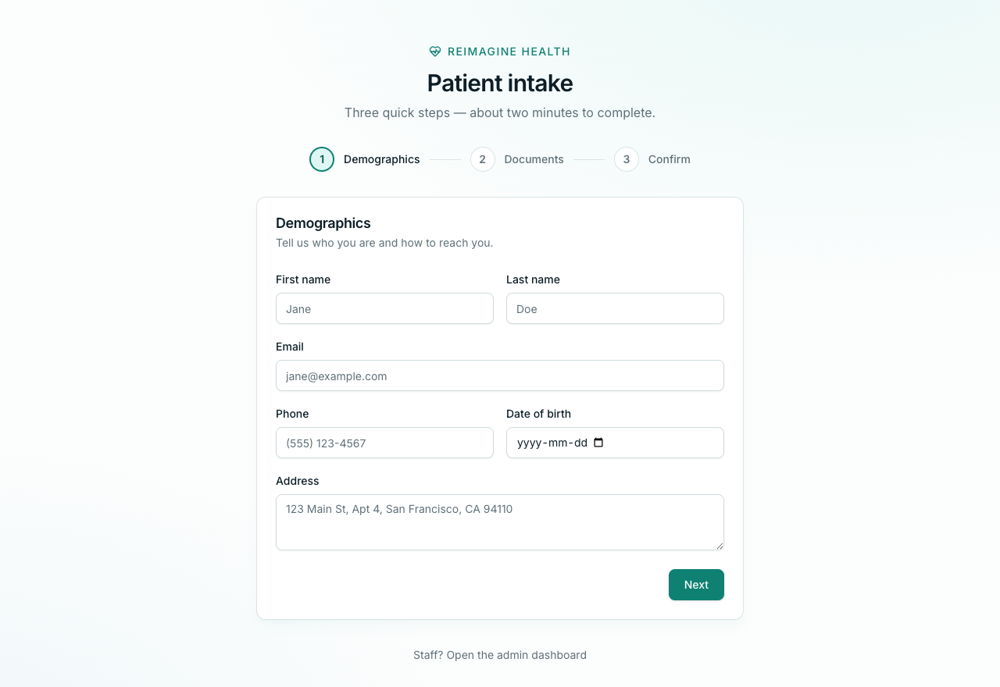
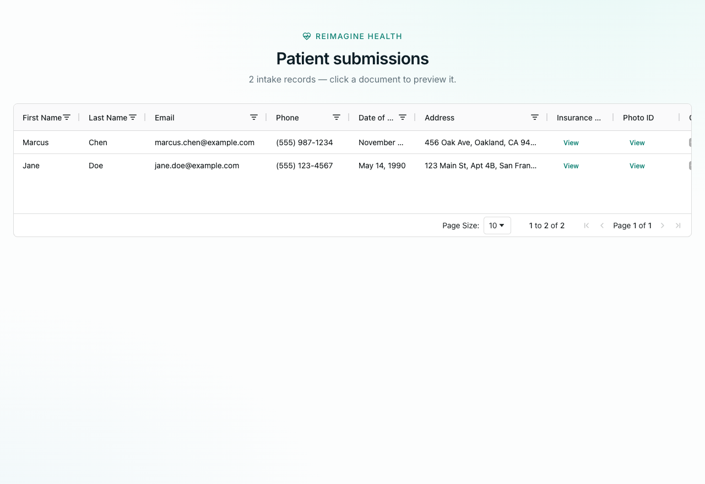
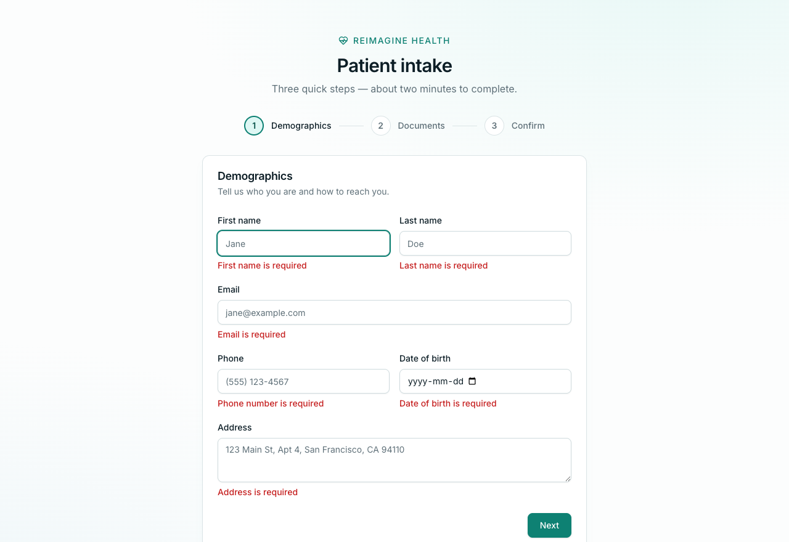
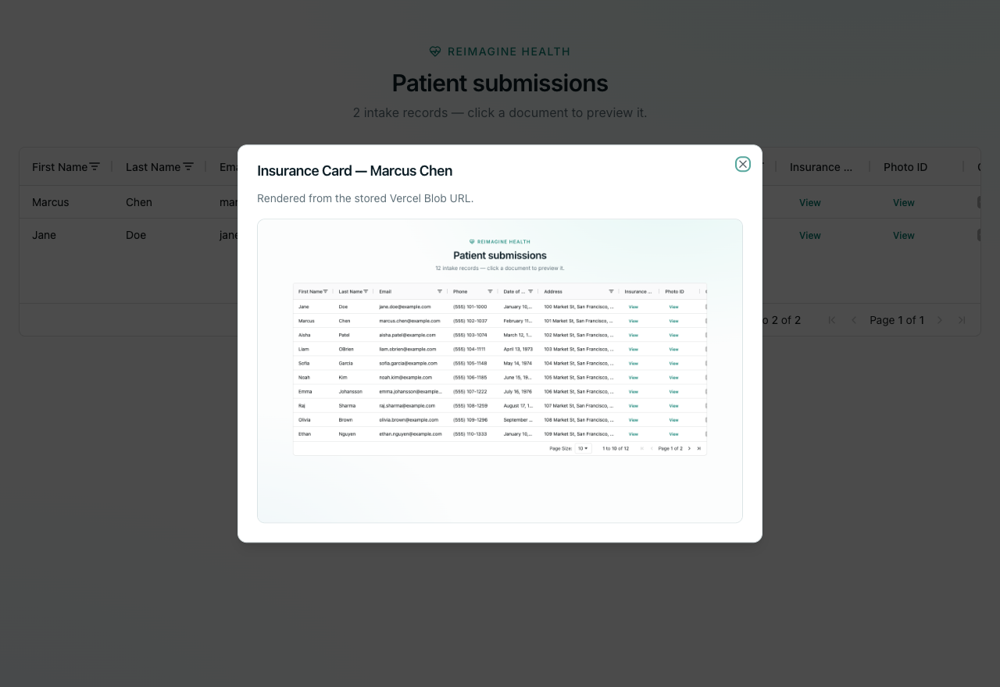
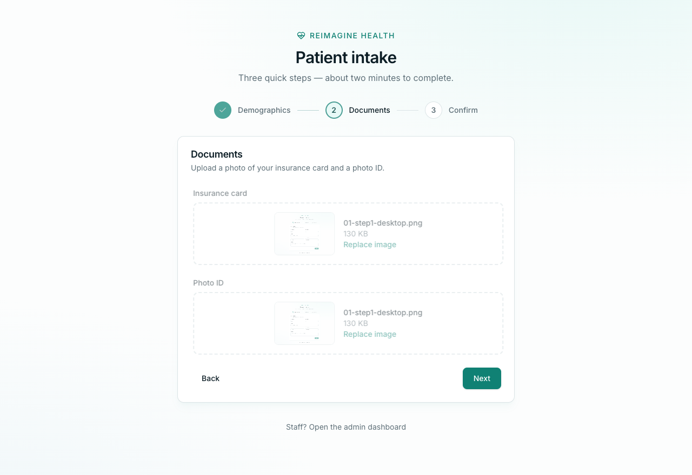
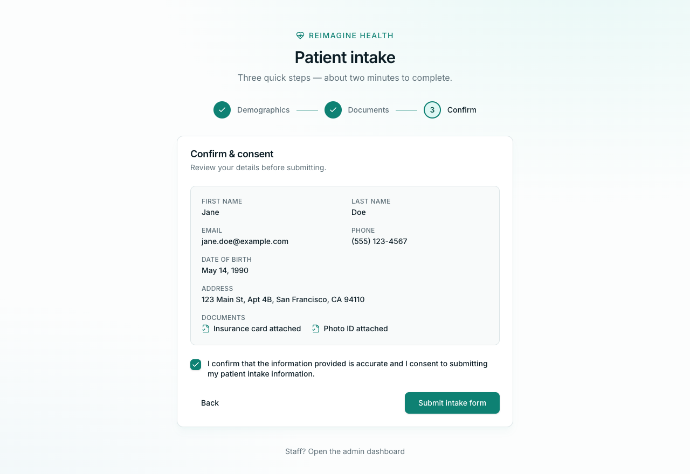
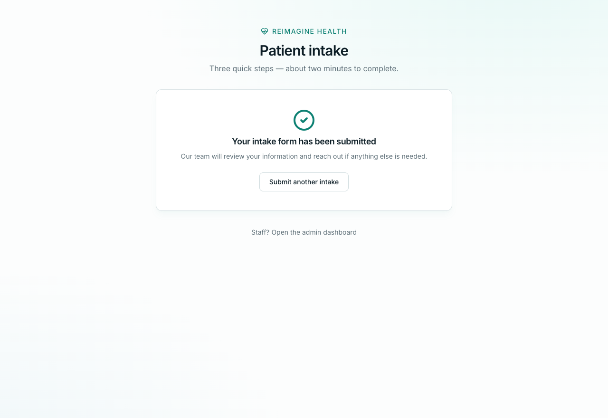
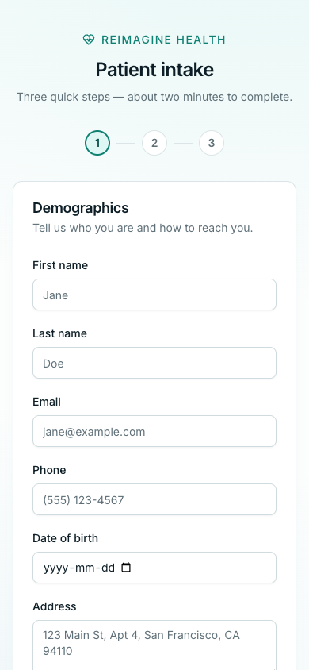

# Reimagine Health — Patient Intake Portal

[](https://github.com/KanwalBoparai/Patient-Intake-Portal/actions/workflows/ci.yml)

Patient intake in three steps (demographics → documents → consent) with an
operational admin dashboard. Next.js Pages Router · Tailwind + shadcn-style
components · GraphQL (Apollo Server + Client) · Supabase Postgres · Vercel
Blob · React-Hook-Form + Zod · Ag-Grid.

**Live deployment:** https://patient-intake-portal-seven.vercel.app

## Run

Requires Node ≥ 18.18 (any current LTS). pnpm is pinned via the
`packageManager` field — `corepack enable` provides it if you don't have it.

```bash
pnpm install
pnpm dev        # http://localhost:3000 (patient form) and /admin (dashboard)
```

`.env` is committed (per assignment instructions) and contains working values:

## Setup (one-time)

1. **Supabase** — create a project, open the SQL editor, run
   [supabase/schema.sql](supabase/schema.sql). Copy the project URL and the
   `service_role` key (Settings → API) into `.env`.
2. **Vercel Blob** — create a Blob store (Vercel dashboard → Storage), copy
   `BLOB_READ_WRITE_TOKEN` into `.env`.
   - Local note: client uploads work on localhost via the token; the
     `onUploadCompleted` webhook only fires on deployed URLs, which this app
     does not depend on.
3. **Deploy** — import the repo in Vercel, paste the same three env vars,
   deploy. Nothing else to configure.

## How it works

- **`/`** — one React-Hook-Form instance + one Zod schema drive the 3-step
  flow; each step validates only its own fields, so values persist across
  navigation. On submit: insurance card → Vercel Blob, photo ID → Vercel
  Blob (browser PUTs directly using tokens minted by `/api/upload`), and
  only after both URLs exist does the `createPatientProfile` GraphQL
  mutation run. Files travel over REST, everything else over GraphQL.
- **`/api/graphql`** — Apollo Server with `createPatientProfile` (re-validates
  with the same Zod schema, single atomic insert) and `getPatientProfiles`
  (newest first).
- **`/admin`** — `getServerSideProps` runs the `getPatientProfiles` query
  in-process via Apollo SchemaLink, rows render in Ag-Grid (sort / filter /
  resize / paginate), document cells open an in-app preview dialog from the
  stored blob URLs.
- **Atomicity** — a profile row physically cannot exist without both
  document URLs and consent: enforced in the client orchestration order, the
  resolver's Zod parse, and the table's `NOT NULL` + `CHECK (consent)`
  constraints.

Decisions and trade-offs are logged in [decision-log.md](decision-log.md).

## Screenshots

Captured from the running app (05–07 on the live Vercel deployment).

| Intake | Admin |
| --- | --- |
|  |  |
|  |  |
|  | |
|  | |
|  |  |
